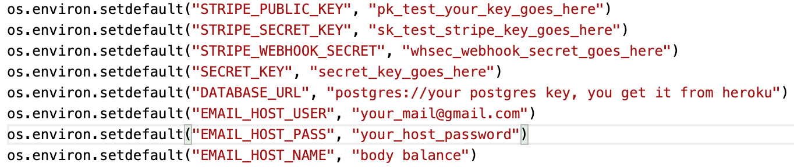
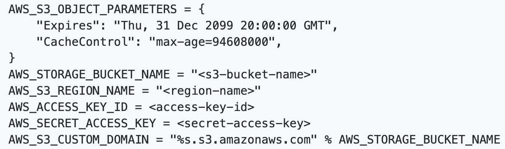
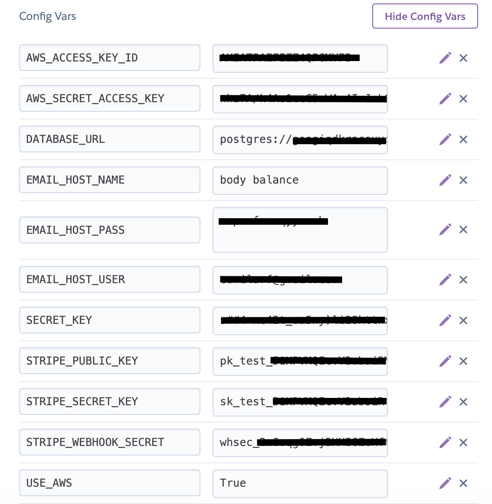

# Body Balance
### [Heroku App](https://body-balance-ms4.herokuapp.com/)
### [GitHub](https://github.com/Camila-Ribeiro/Body-Balance_Milestone-Project)
 
Body Balance is a Milestone Project created for the "Full Stack Frameworks With Django" module of my FullStack Software Development Course offered by [Code Institute](https://codeinstitute.net/).
 
## Table of Contents
1. [**Project overview**](#project-overview)

2. [**UX**](#ux)
  - [**User Stories**](#user-stories)
  - [**Design**](#design)
    - [**Color Scheme**](#color-scheme)
    - [**Typography**](#typography)
  - [**Wireframes**](#wireframes)
 

3. [**Features**](#features)
   - [**Existing Features**](#existing-features)
   - [**Features Left to Implement**](#features-left-to-implement)

4. [**Information Architecture**](#information-architecture)
   - [**Data Models**](#data-models)
     - [**Nutrition App Model**](#nutrition-app-model)
     - [**Subscriptions App Model**](#subscriptions-app-model)
     - [**Products App Model**](#products-app-model)
     - [**Checkout App Model**](#checkout-app-model)
     - [**User Profile App Model**](#user-profile-app-model)

 
5. [**Technologies Used**](#technologies-used)
    - [**Libraries**](#libraries)

 
6. [**Databases Used**](#databases-used)
   - [**Stripe API**](#stripe-api)
   - [**PostgresSQL**](#sostgressql)
   - [**SQlite3**](#sqlite3)
 

7. [**Testing**](#testing)
  - [**Validators**](#validators)
  - [**Manual Testing**](#manual-testing)

 
8. [**Deployment**](#deployment)
  - [**Deploying to Heroku**](#deploying-to-heroku)
  - [**Local development**](#local-development)
  - [**Amazon Web Services(AWS) - S3**](#amazon-web-services(aws)-s3)
      - [**Media And Static Folders**](#media-and-static-folders)
      

9. [**Credits**](#credits)
  - [**Content**](#content)
  - [**Media**](#media)
  - [**Acknowledgements**](#acknowledgements)
 

---
 
## Project overview
Body Balance was built using [Python](https://www.python.org/) - programming language, [Django](https://docs.djangoproject.com/en/3.1/) - which is a high-level Python Web framework that encourages rapid development and clean, pragmatic design and [Hekoru Postgres](https://www.heroku.com/postgres) - a document-based database.
 
 
## UX
 
Body Balance is an online web application designed for users with interest in gathering information about fitness healthy lifestyle as Nutritional plans and also Gym Equipments and Activewear. The website is simple and structured in a way that is easy and intuitive to navigate through. The application is designed for three types of users, the site owner/ administrator (login as superuser) and external users (login as anonymous user, or registered users).

- The anonymous user (users that are not signed in) can:
  - Navigate through the website and see Nutrition and Products page.
  - Search for products
  - Purchase products and nutrition plan
  - Register an account

- The user can:
  - Register an account
  - Log in into their account
  - Search for products
  - Purchase products and nutrition plan
  - If registered already, user can log in into their account and:
     - Access "My profile" page
     - Access Order history
     - Access weekly nutritional plan

- The site owner/administrator (superuser) can:
  - Log in into their account
  - Search for products
  - Purchase products and nutrition plan
  - Access "Product Management" page
  - Access "Nutrition Menu Management" page
  - Access "Plan Management" page
  - Access "My profile" page
  - Access Order history
  - Access weekly nutrition plan menu
  - Add, edit and delete product and all it's specifications
  - Edit nutrition plan menu
  - Edit nutrition plan  
  - Access the Django Admin page through `https://body-balance-ms4.herokuapp.com/admin` and using superuser's authorization as `username` or `email address` and `password`:
     - Access Accounts
     - Access Authentication and Authorization
     - Access a list of Product Orders
     - Edit nutrition plan menu
     - Add, edit and delete product and all it's specifications, including category
     - Edit nutrition plan 
     - Access a list of user profiles
    
    
    

 
### User Stories

See a list of [User Stories](static/UX/ECommerce_User_Stories.pdf) built in using Agile method.

 
### Design
 
A standard layout is fully responsive on mobile devices and larger screens.
 

 
#### Color Scheme
 
- 
- 
- 
- 
- 
- 
 
#### Typography
 
2 [Google Fonts](https://fonts.google.com/) were used across the site:
 - [Roboto](https://fonts.google.com/specimen/Roboto) : body text
 - [Raleway](https://fonts.google.com/specimen/Raleway) : h1, h2, h3, h4, h6

 
### Wireframes
 
My wireframes for this project can be found in the UX folder.
 
- [Desktop Wireframe](static/UX/body_balance_wireframe_desktop.pdf)
- [Mobile Wireframe](static/UX/body_balance_wireframe_mobile.pdf)
 
##### back to [top](#table-of-contents)
 
---
 
## Features
 
### Existing Features
- Index - simple page containing an image, small text and navigation.

- Nutrition - this page displays a Nutrition Plan available for purchase. 
   - Signed in users can purchase the plan clicking on "Buy Nutrition Plan" button where redirects the user to Product Detail page.

  - Signed in users who have already purchased the plan it displays "See Your Plan" button where redirects the user to "My Nutrition Plan"page.
   - For anonymous users it displays a "Register to buy" button where redirects the user to the "Sign Up" page.
   - For superusers it displays an "Edit" button where redirects to the "Edit Plan"page and also "See Your Plan" button where redirects the user to "My Nutrition Plan"page.

- Products - this page displays all products:
   - Products can be filtered by category, price, rating or show all products.
   - There is a search input where the user can search keyword found on product name or product description.
   - Also users can sort products by price (low to high or high to low), rating (low to high or high to low), name (A-Z or Z-a) and category (A-Z or Z-a).
   - It display products categories as Activewear, Gym equipment, Special Offers and Nutrition Plan.
   - The Nutrition Plan is only displayed when the user or anonymous user have not purchased the plan already.
       - for anonymous user it display "Register to buy Nutrition Plan" link.
       - for signed in user who have purchased already it display nothing.
       - for signed in user who have not purchased the plan it displays "Nutrition Plan" link.

- Products Details - this page displays product details such as product name, rating, category, price, size and a button "buy" which redirect the user to the "shop bag" page.

- My Profile - this page displays the user profile details, Order history and a Weekly Nutritional Plan Menu (for subscribers only).
  - Registered user and superuser can:
     - Update their personal details
     - Check their Product Order history
     - Users who purchased the Nutrition Plan can access to their weekly Nutritional Plan Menu.
  - Anonymous don't have access to this page.
  - Sign Out - this page displays a question "Are you sure you want to sign out?" and two buttons: "Cancel and Sign out". Both buttons redirects the user back to index page.
  - Superusers can also see:
     - Product Management - this page is designed only for superusers. It allows them to add products. 
     - Nutrition Menu Management - this page is designed only for superusers. It allows them to edit nutrition menu.
     - Plan Management - this page is designed only for superusers. It allows them to edit the Nutrition Plan such as plan name, description, and price.

- Sign Up - this page has five inputs: e-mail address, e-mail address confirmation, username, password and password(again). It also displays two buttons:
  - "Back to Login" button where redirects the user to the Login page
  - "Sign Up" where redirects the user to a confirmation e-mail page with a message " We have sent an e-mail to you for verification. Follow the link provided to finalize the signup process. Please contact us if you do not receive it within a few minutes." After user confirms the e-mail (link sent to their email address), the user can log in.

- Sign In - this page has two inputs, username or e-mail and password. It also displays two buttons:
  - "Sign" button where redirects the user to the index page
  - "Sign Up" link where redirects the user to the Sign Up page
  - "Forgot Password?" link which redirects to a "Password Reset" page where the user have to type in their e-mail address and click on the "Reset My Password" button, then wait for an e-mail to arrive with instructions to reset the password.

- Error page - this page handles an error page in case the route wasn't found. There is a link to redirect the user back to index.
 

### Features Left to Implement
- Add Nutrition Plan as a montly subscription plan and creat a separe Stripe payment. 
- Add expiry date for the Nutrition Plan as at the moment the only way to stop the user to have access to the plan is when the Admin reset the user has_plan to NO.
- Add additional Nutrition Plan types as at the moment the Admin is able to Edit the only existent Plan.
- Add additional Nutrition Plan Menu as at the moment the Admin is able add 7/day menus at a time instead the fully month.
- Remove Nutrition Plan delivery charge and apply only to the remaining products.

##### back to [top](#table-of-contents)
 
---

## Information Architecture

### Data Choice

### Data Models

#### Nutrition App Model
- Within the `nutrition app`:
   - the `Nutrition model` holds all the data needed for the nutrition menu details (available for subscribers only) in the "My profile" page.

#### Subscriptions App Model
- Within the `subscriptions app`:
   - the `Plan model` holds all the fields needed to populate the "Nutrition" page which contain the Nutrition Plan card where users can a Nutrition Plan available for a month.

#### Products App Model
- Within the `products app`:
   - the `Product model` holds all the data needed for the products in the shop bag.
   - the `Category model` holds all the categories needed to insert products in it.

#### Checkout App Model
- Within the `checkout app`:
   - the `ProductOrder model` holds all the data needed to generate a product order number and additional fields to have an order summary.
   - the `ProductLineOrder model` holds all the data needed to generate a product line order inside the Product Order (admin).

#### UserProfile App Model
- Within the `user_profile app`:
   - the `UserProfile model` maintain default delivery information order history.

#### Authentication and Authorization App Model
The User model utilized for this project is the standard one provided by `django.contrib.auth.models`

##### back to [top](#table-of-contents)

---
 
## Technologies Used
 
 
<b>Built with</b>
 
1. 
 - [Amazon Simple Storage Service (Amazon S3)](https://aws.amazon.com/s3) -  is an object storage service that offers industry-leading scalability, data availability, security, and performance.

2. 
 - [Boto3](https://boto3.amazonaws.com/v1/documentation/api/latest/index.html) - is the Amazon Web Services (AWS) SDK for Python. It enables Python developers to create, configure, and manage AWS services, such as EC2 and S3.

3. 
 - [Chrome Developer Tools](https://developers.google.com/web/tools/chrome-devtools) - is a set of web developer tools built directly into the Google Chrome browser.

4. 
 - [CSS3](https://developer.mozilla.org/en-US/docs/Web/CSS/CSS3) - Used as the base for cascading styles.

5. 
 - [Django3](https://www.djangoproject.com/) - is a high-level Python Web framework that encourages rapid development and clean, pragmatic design.

6. 
 - [Django-Allauth](https://django-allauth.readthedocs.io/en/latest/installation.html) - is an integrated set of Django applications addressing authentication, registration, account management as well as 3rd party (social) account authentication. A very well written library thanks to Raymond Penners. 

7. 
 - [Django Crispy Forms](https://django-crispy-forms.readthedocs.io/en/latest/) - is an application that helps to manage Django forms.

8. 
 - [Django Storages](https://django-storages.readthedocs.io/en/latest/) -  is a collection of custom storage backends for Django to work with boto3 and AWS S3.

9. 
 - [Git](https://git-scm.com/) - open source distributed version control system.

10. 
 - [GitHub](https://github.com/) - is a Web-based hosting service for version control using Git.

11. 
 - [GitIgnore](https://github.com/toptal/gitignore.io) - is a web service designed to help you create .gitignore files for your Git repositories.

12. 
 - [gunicorn](https://pypi.org/project/gunicorn/) - is a Python WSGI HTTP Server for UNIX. It’s a pre-fork worker model ported from Ruby’s Unicorn project. The Gunicorn server is broadly compatible with various web frameworks, simply implemented, light on server resource usage, and fairly speedy.

13. 
 - [Heroku](https://dashboard.heroku.com/) - lets you deploy, run and manage applications written in Ruby, Node.js, Java, Python, Clojure, Scala, Go and PHP.

14. 
 - [HTML5](https://developer.mozilla.org/en-US/docs/Web/Guide/HTML/HTML5) - used as the base for markup text.

15. 
 - [JavaScript](https://www.javascript.com/) -  is a scripting or programming language that allows you to implement complex features on web pages.

16. 
 - [jQuery](https://jquery.com/) - is a fast, small, and feature-rich JavaScript library. It makes things like HTML document traversal and manipulation, event handling, animation, and Ajax much simpler with an easy-to-use API that works across a multitude of browsers.

17. 
 - [Jinja2](https://jinja.palletsprojects.com/en/2.11.x/) - a full featured template engine for Python.

18. 
 - [Pillow](https://pillow.readthedocs.io/en/stable/) -  is the friendly PIL fork by Alex Clark and Contributors. PIL is the Python Imaging Library by Fredrik Lundh and Contributors.

19. 
 - [PIP](https://pip.pypa.io/en/stable/installing/) - is the standard package manager for Python. It allows you to install and manage additional packages that are not part of the Python standard library.

20. 
 - [Python](https://www.python.org/downloads/release/python-383/) - is a scripting language.

21. 
 - [Werkzeug](https://werkzeug.palletsprojects.com/en/1.0.x/) - is a WSGI utility library for Python.

22. 
 - [WTforms](https://pypi.org/project/WTForms/) - is  a framework agnostic library handling web forms in python.

#### Libraries
 
- [Bootstrap 4](https://getbootstrap.com/) - is a framework for building responsive, mobile-first websites.
- [FontAwesome](https://fontawesome.com/) - is a font and icon toolkit based on CSS and Less. It was used to provide icons across the website.
- [jQuery](https://jquery.com/download/) - is a lightweight, "write less, do more", JavaScript library. The purpose of jQuery is to make it much easier to use JavaScript on your website.
- [Psycopg2](https://pypi.org/project/psycopg2/) - is the most popular PostgreSQL database adapter for the Python programming language.
- [Bootsrap Select](https://developer.snapappointments.com/bootstrap-select/) - is a jQuery plugin that brings select elements into the 21st century with intuitive multiselection, searching, and much more.
##### back to [top](#table-of-contents)
 
---
## Databases Used

### Stripe API
[Stripe API](https://stripe.com/en-ie) is a payment processor, which means they support the electronic transfer of money from a customer's bank (issuing bank) into a merchant's bank (acquiring bank) as payment for goods or services bought with a credit card.
 
### PostgresSQL
[PostgresSQL](https://www.postgresql.org/) is a powerful, open source object-relational database system that uses and extends the SQL language combined with many features that safely store and scale the most complicated data workloads.
 
### SQlite3
 
[SQLite](https://www.sqlite.org/) is a C-language library that implements a small, fast, self-contained, high-reliability, full-featured, SQL database engine. 

The SQLite file format is stable, cross-platform, and backwards compatible and the developers pledge to keep it that way through at least the year 2050. SQLite database files are commonly used as containers to transfer rich content between systems [1] [2] [3] and as a long-term archival format for data [4]. 

##### back to [top](#table-of-contents)
 
---
 
## Testing
 
The project guidelines stated that a Test Driven Development (TDD) approach should be taken to developing the web application but I only manual testing was conducted during this project to fix bugs I used print() method. I utlined most of what I did below for documentation purposes.
I also have validated all files using online validation sites and checked across different browsers and devices.
 
 
### Validators
 
#### HTML
 
- [W3C HTML Validator](https://validator.w3.org/) - `The W3C Validator tool doesn't recognize the Jinja templating, which has resulted in it showing a lot of errors in relation to the Jinja code.`
 
#### CSS
 
- [W3C CSS Validator](https://jigsaw.w3.org/css-validator/) - `Congratulations! No Error Found.`
 
#### PYTHON
 
- [Pep8 Online tool](http://pep8online.com/) - `All right` for all python files except for few long lines as I left for better reading purpose.
 
#### JavaScript
 - [JShint](https://jshint.com/)
  - File: [stripe.js](checkout/static/checkout/js/stripe.js)
       - Metrics:
           - There are 5 functions in this file.
           - Function with the largest signature takes 1 arguments, while the median is 1.
           - Largest function has 10 statements in it, while the median is 5.
           - The most complex function has a cyclomatic complexity value of 3 while the median is 1.
 
  - File: [jquery.star-rating-svg.js](products/static/products/js/jquery.star-rating-svg.js)
       - Metrics:
           - There are 29 functions in this file.
           - Function with the largest signature takes 4 arguments, while the median is 1.
           - Largest function has 16 statements in it, while the median is 4.
           - The most complex function has a cyclomatic complexity value of 13 while the median is 2.

  - File: [country_field.js](user_profile/static/user_profile/js/country_field.js)
       - Metrics:
          - There is only one function in this file.
          - It takes no arguments.
          - This function contains 4 statements.
          - Cyclomatic complexity number for this function is 2.
 
 
### Manual Testing
I have conducted a detailed [manual testing](static/testing/manual/testing.md) to show that I have extensively tested this web application.
 - I used Google Chrome's Development tools to constantly test each change that I made to my project and to ensure that it appeared in the desired way on different screen sizes.
 - I also tested my app on different screen sizes (mobile, tablet and desktop) to ensure
it appeared in the desired way on different devices.
 
##### back to [top](#table-of-contents)
 
---
 
## Deployment

### Deploying to Heroku
 
[Body Balance](https://github.com/Camila-Ribeiro/Body-Balance_Milestone-Project) was developed  locally using **VS Code**, and all commits were pushed to [**Heroku**](https://body-balance-ms4.herokuapp.com/) using [**Git**](https://git-scm.com/).
 
In order to get the application ready for deployment I followed the next steps:
1. I removed all my hard-coded environment variables from settings.py to protect my Database name, secret-key and passwords and placed them in the env.py for development and entered it into herouku's Config Var for production.

2. On the terminal window using the command `pip3 freeze > requirements.txt` I installed `requirements.txt` file, which contains a list of items to be installed, defining the modules imported to Heroku.

3. Set up the Procfile (Remember to use a capital P in Procfile). using the command `echo web: python app.py > Procfile` - The Procfile file contains `web: gunicorn body_balance.wsgi:application` which tells Heroku to start a process called web and to run `python manage.py` when it starts.

4. Created the app in Heroku.

5. Went to the Resources tab in Heroku and searched for Heroku Postgres in the 'Add-Ons' section.

6. Selected the free Hobby level.

7. Updated the `.bashrc` file within my local workspace with the `DATABASE_URL` details, and the `settings.py` to connect to the database using the `dj_database_url` package.

8. Ran the `python3 manage.py makemigrations`, `python3 manage.py migrate`, `python3 manage.py createsuperuser` commands to migrate the models into Heroku Postgres and create a new superuser in the new PostgreSQL database.

9. Went to the Settings tab in Heroku and clicked on the Reveal Config Vars button.

10. Copied and paste all of the default variables from env.py in to Heroku's Config Vars section.
 

11. Went to the Deploy tab in Heroku, connected my app to my GitHub repository and selected Enable Automatic Deployment as the deployment method.

12. Went to the Developers section in Stripe and clicked on API Keys.

13. Copied and pasted the Publishable Key and Secret Key and set them as the `STRIPE_PUBLIC_KEY` and `STRIPE_SECRET_KEY` environment variables in the `.bashrc` file within my local workspace.

14. Updated the `settings.py` with the new Stripe environment variables.

15. Went to the S3 section of AWS and created a new S3 bucket.

16. Updated the `settings.py` file in my local workspace with the relevant S3 bucket details:

17. Created a `custom_storages.py` file with classes to route to the relevant location settings for static and media files.

18. Updated the `settings.py` file with the relevant configuration for static and media file storage.

19. Ran the `python3 manage.py collectstatic` command to push the static files to my S3 bucket.

20. Ran the `git add .`, `git commit -m "<commit-message>"` and `git push - u origin master` commands to push all changes to my GitHub repository.
 
**IMPORTANT NOTE**:
 
- Please allow a few minutes to pass before opening your newly deployed link! Clicking this link too quickly may result in a failure to build the site, causing an Error 404 page instead.
 
Congratulations! Your project should be deployed successfully on Heroku's app! :tada:

### Local Development
To run this project locally on your own system, users can clone to their desktop by completing the following steps:

1. Go to [my GitHub repository](https://github.com/Camila-Ribeiro/Body-Balance_Milestone-Project).

2. Click on 'Code'(green button) placed beside Gitpod button.

3. Copy the clone URL for the repository in the 'Clone with HTTPs section'.

4. Open 'Git Bash' in your local IDE.

5. Change the current working directory to the location where you want the cloned directory to be made. (e.g. cd projects).

6. Type `git clone`, then paste the URL you copied in Step 3: `git clone` `https://github.com/USERNAME/REPOSITORY`

7. Press `Enter` to complete the process and create your local clone.

8. Create a `.env,py` file with your own credentials and import this into the `settings.py` file.

9. Install the requirements.txt file by running the below command in your CLI Terminal:
`pip3 install -r requirements.txt`.

10. Run one of the following commands in your Terminal to launch the Django project:
`python3 manage.py runserver`

11. Click the `http:// link` that loads, and the project should load. If it doesn't load when you click the link, copy and paste it into a new browser tab instead.

12. Run the following commands to migrate the database models and create a super user:
`python3 manage.py makemigrations
python3 manage.py migrate
python3 manage.py createsuperuser`

13. In the heroku dashboard for the application, click on "Settings" > "Reveal Config Vars".
14. Set the following config vars in heroku :

Once the migrations are completed and the super user has been created successfully, the site should be running locally.

### Amazon Web Services(AWS) - S3

#### Media And Static Folders
In early development of the project `static` and `media` folders were pushed to GitHub. At a later stage both folders were stored on [AWS - S3 bucket](https://docs.aws.amazon.com/AmazonS3/latest/gsg/CreatingABucket.html) which is a cloud-based storage service from [Amazon](https://aws.amazon.com) for the live version of the site.

To allow you to access all functionality on the site locally, ensure you have created free accounts with the following services: 

-[Stripe](https://stripe.com/)

-[AWS - S3 bucket](https://docs.aws.amazon.com/AmazonS3/latest/gsg/CreatingABucket.html)

#### In Gitpod or your IDE  you create env.py file in main directory and write in first line: import os. Use table below to copy required fields.

 
##### back to [top](#table-of-contents)
 
---
 
## Credits
 
### Content
 
- [Stipe API](https://stripe.com/) - Database payment integration
 
### Media
- [Alexia Clark](https://alexia-clark.com/) - all texts used in the homepage and nutrition page
- [Very Well Fit](https://www.verywellfit.com/an-example-of-a-healthy-balanced-meal-plan-2506647#day-1) - recipes used on nutrition plan menu 
- [Unsplash](https://unsplash.com/) 
  - Photo by Scott Webb - Homepage
  - Photo by Louis Hanse - Nutrition page
  - Photo by Brook Lark - Menu/Day 1
  - Photo by Ella Olsson - Menu/Day 2
  - Photo by Clarissa Carbungco - Menu/Day 3
  - Photo by Louis Hansel - Menu/Day 4
  - Photo by Brenda Godinez - Menu/Day 5
  - Photo by Jannis Brandt - Menu/Day 6
  - Photo by Ella Olsson - Menu/Day 7

 
### Acknowledgements
 
I received inspiration for this project from Code Institute - Project Ideas and specially the Boutique Ado Project from Chris Zielinski.
 
##### back to [top](#table-of-contents)
 
